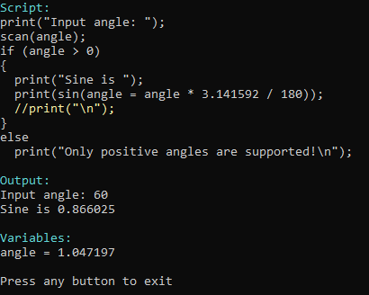

# T32OPS: Script language executor
Last code update: 06.06.2023

This project include a scanner, a parser, and a virtual machine for script language. This language has a C-like syntax, support function defined in the virtual machine, and does not support typing (see 'Code.txt').

Script execution example:

